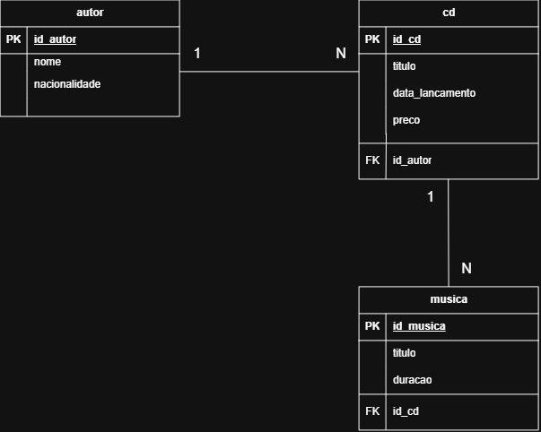
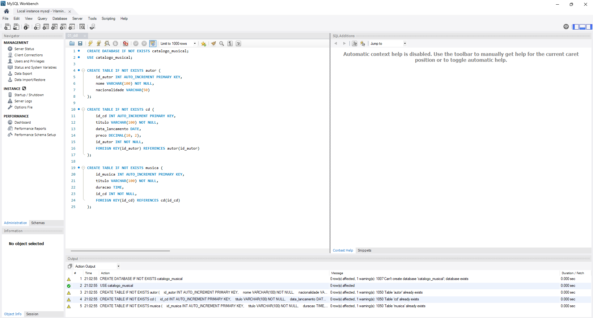
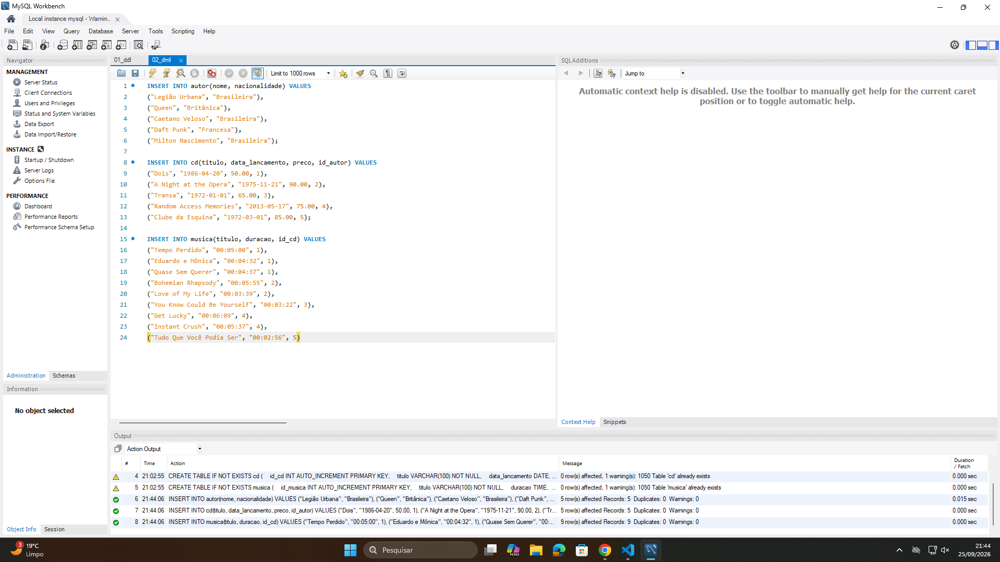
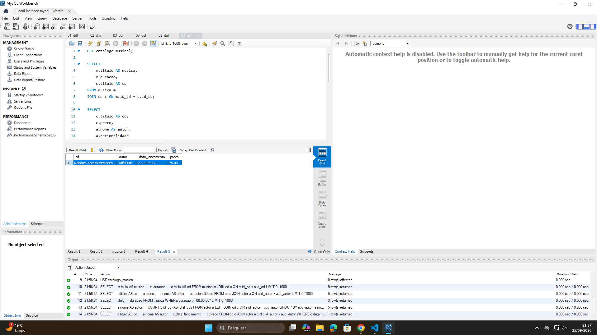

# Atividade em Aula — Exercícios Introdutórios de Banco de Dados

## 📌 Descrição do Projeto
Resolução prática da atividade de Banco de Dados Relacional e SQL, contemplando modelagem (MER/DER), scripts de criação (DDL), implemento (DML), consultas (DQL) e registros de execução.

---

## 📐 Modelagem
- **MER (Modelo Entidade-Relacionamento):** [Visualizar documentação](docs/MER.md)
- **DER (Diagrama Entidade-Relacionamento):**
  
  

---

## 🛠️ Scripts SQL
- 📜 [01_ddl.sql — Criação das Tabelas](scripts/01_ddl.sql)
- 📜 [02_dml.sql — Inserção de Dados Fictícios](scripts/02_dml.sql)
- 📜 [03_dql.sql — Consultas Solicitadas](scripts/03_dql.sql)

---

## 📸 Evidências de Execução no MySQL Workbench

### 1. Criação das Tabelas (DDL)
   

### 2. Implementação dos Dados (DML)
   

### 3. Consultas Realizadas (DQL)
   